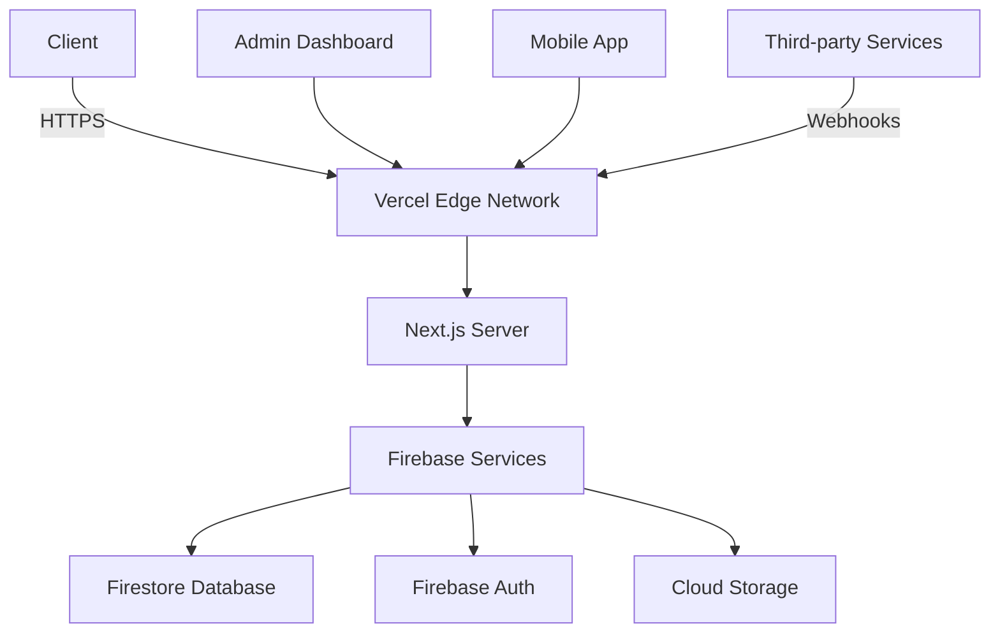

<div align="center">
  <h1 align="center">🏛️ Library Management System</h1>
  <p align="center">
    <strong>A modern, scalable solution for educational institutions</strong>
  </p>
  
  <p align="center">
    <a href="https://github.com/Mayankdaya/library-management-system">
      
    </a>
    <a href="https://github.com/Mayankdaya/library-management-system/network/members">
      
    </a>
    <a href="https://opensource.org/licenses/MIT">
      
    </a>
    <a href="https://vercel.com">
      
    </a>
  </p>

  <p align="center">
    <a href="#-features">Features</a> •
    <a href="#-demo">Demo</a> •
    <a href="#-getting-started">Getting Started</a> •
    <a href="#-tech-stack">Tech Stack</a> •
    <a href="#-contributing">Contributing</a> •
    <a href="#-license">License</a>
  </p>

  <p align="center">
    
  </p>
</div>

## 🚀 Overview

The Library Management System is a comprehensive solution designed to modernize library operations for educational institutions. Built with Next.js, React, and Firebase, it offers a seamless experience for both administrators and patrons with real-time updates and an intuitive interface.

## 📸 Screenshots

<div align="center">

### 🖥️ Main Dashboard
[](https://github.com/user-attachments/assets/98bda8f4-853d-44cc-8fec-287a24bab2c1)
*Figure 1: Main dashboard showing key metrics and quick actions*

### 📚 Book Catalog
[](https://github.com/user-attachments/assets/772273c2-405c-49af-b00d-4925b23992d8)
*Figure 2: Browse and search through the extensive book collection*

### 👤 User Profile
[](https://github.com/user-attachments/assets/16d4517f-7bcb-438d-8c2f-3b8addd766ec)
*Figure 3: User profile and account management*

</div>

[](https://github.com/Mayankdaya/library-management-system/stargazers)
[](https://github.com/Mayankdaya/library-management-system/network/members)
[](https://github.com/Mayankdaya/library-management-system/issues)
[](https://github.com/Mayankdaya/library-management-system/pulls)
[](https://github.com/Mayankdaya/library-management-system/graphs/contributors)

</div>

[](https://library-management-system-724lvgg2i-mayanks-projects-cf71e909.vercel.app/)
[](https://github.com/Mayankdaya/library-management-system/stargazers)
[](LICENSE)

</div>

---

## ✨ Key Features

### 📚 Core Functionality

| Feature | Description |
|---------|-------------|
| **Role-Based Access Control** | Multi-level user roles with granular permissions and OAuth 2.0 integration |
| **Book Management** | Advanced cataloging system with digital asset management and metadata support |
| **Circulation** | Automated check-in/check-out with reservation system and fine calculation |
| **Analytics** | Real-time statistics and custom reporting with predictive analytics |
| **Multi-tenant** | Support for multiple libraries with isolated data and custom branding |

### 🛡️ Security

- **End-to-end encryption** for sensitive data
- **Rate limiting** and DDoS protection
- Comprehensive **audit logging**
- **GDPR compliance** tools
- Automated **backup** system
- **IP whitelisting** for admin access

### 📱 User Experience

- **Responsive design** works on all devices
- **Dark/Light** mode support
- **Keyboard** navigation
- **Progressive Web App** (PWA) support
- **Offline** functionality for core features

## 🚀 Getting Started

### Prerequisites

- Node.js 18.x or later
- npm 9.x or later / yarn 1.22.x or later
- Firebase account (for backend services)
- Git (for version control)

### Local Development

1. **Clone the repository**
   ```bash
   git clone https://github.com/Mayankdaya/library-management-system.git
   cd library-management-system
   ```

2. **Install dependencies**
   ```bash
   npm install
   # or
   yarn
   ```

3. **Set up Firebase**
   - Create a new project in the [Firebase Console](https://console.firebase.google.com/)
   - Enable Authentication, Firestore, and Storage services
   - Create a new web app and get your Firebase configuration

4. **Configure environment variables**
   Create a `.env.local` file in the root directory:
   ```env
   # Firebase Configuration
   NEXT_PUBLIC_FIREBASE_API_KEY=your_api_key
   NEXT_PUBLIC_FIREBASE_AUTH_DOMAIN=your_project_id.firebaseapp.com
   NEXT_PUBLIC_FIREBASE_PROJECT_ID=your_project_id
   NEXT_PUBLIC_FIREBASE_STORAGE_BUCKET=your_project_id.appspot.com
   NEXT_PUBLIC_FIREBASE_MESSAGING_SENDER_ID=your_sender_id
   NEXT_PUBLIC_FIREBASE_APP_ID=your_app_id

   # Optional: Set to 'true' to enable experimental features
   NEXT_PUBLIC_ENABLE_EXPERIMENTAL_FEATURES=false
   ```

5. **Run the development server**
   ```bash
   npm run dev
   # or
   yarn dev
   ```

6. **Open your browser**
   Visit [http://localhost:3000](http://localhost:3000) to view the application

### Production Build

To create a production build:

```bash
# Build the application
npm run build

# Start the production server
npm start
```

### Environment Variables

| Variable | Description | Required |
|----------|-------------|----------|
| `NEXT_PUBLIC_FIREBASE_*` | Firebase configuration | Yes |
| `NEXT_PUBLIC_ENABLE_EXPERIMENTAL_FEATURES` | Enable experimental features | No |

## 🏗 System Architecture

### High-Level Architecture



## 🛠 Tech Stack

### Frontend

| Technology | Description |
|------------|-------------|
| [Next.js 13+](https://nextjs.org/) | React framework with server-side rendering and static site generation |
| [React 18](https://reactjs.org/) | JavaScript library for building user interfaces |
| [TypeScript](https://www.typescriptlang.org/) | Strongly typed programming language |
| [Tailwind CSS](https://tailwindcss.com/) | Utility-first CSS framework |
| [Radix UI](https://www.radix-ui.com/) | Unstyled, accessible UI components |
| [React Hook Form](https://react-hook-form.com/) | Form validation and management |
| [Zod](https://zod.dev/) | TypeScript-first schema validation |

### Backend

| Service | Description |
|---------|-------------|
| [Firebase Authentication](https://firebase.google.com/docs/auth) | User authentication and management |
| [Cloud Firestore](https://firebase.google.com/docs/firestore) | NoSQL document database |
| [Firebase Storage](https://firebase.google.com/docs/storage) | File storage and serving |
| [Firebase Hosting](https://firebase.google.com/docs/hosting) | Web hosting with global CDN |

### Development Tools

| Tool | Purpose |
|------|---------|
| [Git](https://git-scm.com/) | Version control |
| [ESLint](https://eslint.org/) | Code linting |
| [Prettier](https://prettier.io/) | Code formatting |
| [Husky](https://typicode.github.io/husky/) | Git hooks |
| [Commitlint](https://commitlint.js.org/) | Commit message linting |

### DevOps

| Service | Description |
|---------|-------------|
| [Vercel](https://vercel.com) | Frontend hosting and CI/CD |
| [GitHub Actions](https://github.com/features/actions) | Automated testing and deployment |
| [Sentry](https://sentry.io/) | Error tracking and monitoring |
| [Vercel Analytics](https://vercel.com/analytics) | Web analytics |

### 🧩 Tech Stack Details

<details>
<summary><b>Frontend Layer</b></summary>

- **Framework**: Next.js 13.4+ (App Router, Server Components, Streaming SSR)
- **UI Components**: Radix UI (Headless, Accessible, Unstyled)
- **Styling**: Tailwind CSS 3.3+ with CSS Modules
- **State Management**: React Query + Zustand
- **Form Handling**: React Hook Form + Zod Validation
- **Data Visualization**: Recharts + D3.js
- **Internationalization**: next-intl
- **Testing**: Jest + React Testing Library + Cypress

</details>

<details>
<summary><b>Backend Layer</b></summary>

- **Runtime**: Node.js 18+ (LTS)
- **API**: Next.js API Routes + tRPC
- **Authentication**: Firebase Auth (JWT, OAuth 2.0, SAML)
- **Database**: Firestore (NoSQL) with Redis Cache
- **Search**: Algolia Integration
- **Real-time**: Firebase Realtime Database
- **Background Jobs**: Firebase Cloud Functions
- **File Storage**: Firebase Storage + Image Optimization

</details>

<details>
<summary><b>DevOps & Infrastructure</b></summary>

- **Hosting**: Vercel (Edge Network, Serverless Functions)
- **CI/CD**: GitHub Actions
- **Monitoring**: Sentry + LogRocket
- **Performance**: Lighthouse CI + Web Vitals
- **Containerization**: Docker + Kubernetes
- **Infrastructure as Code**: Terraform
- **Documentation**: Swagger + Storybook

</details>

### Key Technologies & Libraries

<details>
<summary><b>📱 Frontend Technologies</b></summary>

- **Framework**: Next.js 13+ (App Router with Server Components)
- **UI Components**: Radix UI (Accessible, Unstyled Components)
- **Styling**: Tailwind CSS with CSS Modules
- **Form Handling**: React Hook Form with Zod Validation
- **State Management**: React Context + Custom Hooks
- **Icons**: Lucide Icons (Lightweight, Customizable Icons)
- **Animation**: Framer Motion for smooth transitions

</details>

<details>
<summary><b>🔧 Backend & Infrastructure</b></summary>

- **Hosting**: Vercel (Serverless Functions, Edge Network)
- **Database**: Firebase Firestore (NoSQL, Real-time Updates)
- **Authentication**: Firebase Authentication (Email/Password, Google SSO)
- **Storage**: Firebase Storage for file uploads
- **API**: RESTful API with Next.js API Routes
- **Real-time**: Firebase Realtime Database for live updates

</details>

<details>
<summary><b>🛠 Development Tools</b></summary>

- **Package Manager**: npm / Yarn
- **Linting**: ESLint with TypeScript support
- **Code Formatting**: Prettier
- **Version Control**: Git with Conventional Commits
- **CI/CD**: GitHub Actions for automated testing and deployment
- **Performance**: Lighthouse CI for performance monitoring

</details>

### Performance Metrics

[]()
[]()
[]()
[]()

> *Optimized for performance, accessibility, and SEO out of the box*

## 📂 Project Structure

```
src/
├── app/                 # App router pages
├── components/          # Reusable UI components
├── lib/                 # Utility functions and configs
├── hooks/               # Custom React hooks
├── styles/              # Global styles
└── types/               # TypeScript type definitions
```

## 📚 API Documentation

### REST API Endpoints

| Endpoint | Method | Description | Authentication |
|----------|--------|-------------|----------------|
| `/api/books` | GET | List all books | 🔒 Required |
| `/api/books/:id` | GET | Get book details | 🔒 Required |
| `/api/checkout` | POST | Checkout book | 🔒 Required |
| `/api/users` | GET | List users | 🔒 Admin Only |

### WebSocket Events

```typescript
// Subscribe to real-time updates
const unsubscribe = onSnapshot(
  query(collection(db, "books")), 
  (snapshot) => {
    // Handle updates
  }
);
```

## 🧪 Testing Strategy

```bash
# Run unit tests
npm test

# Run integration tests
npm run test:integration

# Run E2E tests
npm run test:e2e

# Generate coverage report
npm run test:coverage
```

## 🚀 Deployment

### Production
```bash
# Build for production
npm run build

# Start production server
npm start
```

### Environment Variables
```env
# Firebase Configuration
NEXT_PUBLIC_FIREBASE_API_KEY=your_api_key
NEXT_PUBLIC_FIREBASE_AUTH_DOMAIN=your_auth_domain
NEXT_PUBLIC_FIREBASE_PROJECT_ID=your_project_id

# Feature Flags
NEXT_PUBLIC_ENABLE_EXPERIMENTAL_FEATURES=false
NEXT_PUBLIC_MAINTENANCE_MODE=false
```

## 🤝 Contributing

We welcome contributions from the community! Whether it's bug reports, feature requests, or code contributions, all are appreciated.

### How to Contribute

1. **Report Bugs**
   - Check if the issue already exists in the [issues](https://github.com/Mayankdaya/library-management-system/issues) section
   - If not, create a new issue with a clear description and steps to reproduce

2. **Request Features**
   - Open an issue with the `enhancement` label
   - Describe the feature and its benefits

3. **Code Contributions**
   - Fork the repository
   - Create a feature branch (`git checkout -b feature/amazing-feature`)
   - Commit your changes (`git commit -m 'Add some amazing feature'`)
   - Push to the branch (`git push origin feature/amazing-feature`)
   - Open a pull request

### Development Setup

1. Install dependencies:
   ```bash
   npm install
   ```

2. Set up pre-commit hooks:
   ```bash
   npx husky install
   ```

3. Make sure all tests pass:
   ```bash
   npm test
   ```

4. Lint your code:
   ```bash
   npm run lint
   ```

### Code Style

- Follow the [Airbnb JavaScript Style Guide](https://github.com/airbnb/javascript)
- Use [Conventional Commits](https://www.conventionalcommits.org/) for commit messages
- Write tests for new features and bug fixes
- Keep the codebase clean and well-documented

### Pull Request Process

1. Update the README.md with details of changes if needed
2. Ensure tests pass and add new tests as needed
3. Request code review from maintainers
4. Once approved, your PR will be merged

---

## 📄 License

This project is licensed under the MIT License - see the [LICENSE](LICENSE) file for details.

### Third-Party Licenses

This project uses several open-source libraries. For a complete list of dependencies and their licenses, see the [package.json](package.json) file.

### Attribution

- [Next.js Documentation](https://nextjs.org/docs)
- [Firebase Documentation](https://firebase.google.com/docs)
- [Tailwind CSS Documentation](https://tailwindcss.com/docs)
- [Radix UI Documentation](https://www.radix-ui.com/docs)

---

## 📚 Resources

### Documentation

| Document | Description |
|----------|-------------|
| [API Reference](/docs/API.md) | Complete API documentation and endpoints |
| [Database Schema](/docs/SCHEMA.md) | Database structure and relationships |
| [Deployment Guide](/docs/DEPLOYMENT.md) | Step-by-step deployment instructions |
| [Testing Guide](/docs/TESTING.md) | How to run and write tests |

### Related Projects

| Project | Description |
|---------|-------------|
| [Library Mobile App](https://github.com/Mayankdaya/library-mobile) | Cross-platform mobile application |
| [Admin Dashboard](https://github.com/Mayankdaya/library-admin) | Advanced administration interface |
| [API Service](https://github.com/Mayankdaya/library-api) | Backend API service |

### Learning Resources

- [Next.js Documentation](https://nextjs.org/docs)
- [Firebase Documentation](https://firebase.google.com/docs)
- [Tailwind CSS Documentation](https://tailwindcss.com/docs)
- [Radix UI Documentation](https://www.radix-ui.com/docs)
- [TypeScript Handbook](https://www.typescriptlang.org/docs/)

---

## 🙏 Acknowledgments

We'd like to thank the following open-source projects and communities that made this project possible:

- The [Next.js](https://nextjs.org/) team for an amazing React framework
- [Firebase](https://firebase.google.com/) for providing a robust backend
- [Tailwind CSS](https://tailwindcss.com/) for utility-first CSS
- [Radix UI](https://www.radix-ui.com/) for accessible UI primitives
- All our contributors and users for their valuable feedback

---

## 📬 Contact

For questions, support, or just to say hi, feel free to reach out:

- **Email**: [mayankdayal2022@vitbhopal.ac.in](mailto:mayankdayal2022@vitbhopal.ac.in)
- **GitHub**: [@Mayankdaya](https://github.com/Mayankdaya)
- **LinkedIn**: [Mayank Dayal](https://www.linkedin.com/in/mayank-dayal-1b2b3c4d/)

---

<div align="center">
  <p>
    Made with ❤️ by <a href="https://github.com/Mayankdaya">Mayank Dayal</a>
  </p>
  <p>
    <a href="https://github.com/Mayankdaya/library-management-system/graphs/contributors">
      
    </a>
    <a href="https://github.com/Mayankdaya/library-management-system/network/members">
      
    </a>
    <a href="https://github.com/Mayankdaya/library-management-system/stargazers">
      
    </a>
    <a href="https://github.com/Mayankdaya/library-management-system/issues/">
      
    </a>
    <a href="https://github.com/Mayankdaya/library-management-system/blob/main/LICENSE">
      
    </a>
  </p>
</div>


<div align="center">
  <br />
  <p>
    <a href="https://github.com/Mayankdaya/library-management-system/graphs/contributors">
      
    </a>
    <a href="https://github.com/Mayankdaya/library-management-system/network/members">
      
    </a>
    <a href="https://github.com/Mayankdaya/library-management-system/stargazers">
      
    </a>
    </a>
  </p>
  
  <!-- Footer -->
  <div style="margin-top: 50px; padding: 30px 0; background-color: #f8f9fa; border-top: 1px solid #eaecef;">
    <div style="max-width: 1200px; margin: 0 auto; padding: 0 20px;">
      <div style="display: flex; flex-wrap: wrap; justify-content: space-between; gap: 30px;">
        <!-- About Section -->
        <div style="flex: 1; min-width: 200px;">
          <h3 style="color: #24292e; margin-bottom: 15px;">Library Management System</h3>
          <p style="color: #6a737d; line-height: 1.6; font-size: 0.9em;">
            A modern, scalable solution for managing library resources with real-time updates and an intuitive interface.
          </p>
        </div>
        
       
